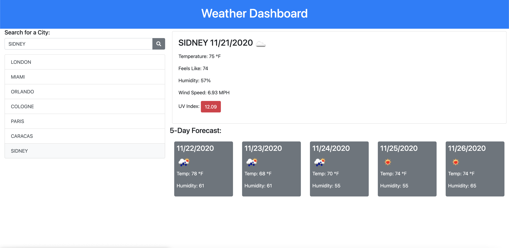

# 6-Server-Side-APIs-Challenge

 
 

## Purpose
6-Server-Side-APIs-Challenge is a GitHub's API to search for open source projects with open issues and pull requests.
 
 

## Contents
1. [Requirements/Description](#requirements/description)
2. [Installation](#installation)
3. [Contribution](#contribution)
4. [Built With/Technologies](#built-with/technologies)
5. [API's](#apis)
6. [Issues](#issues)
 
 

## Requirements/Description
### User Story
* AS A traveler I WANT to see the weather outlook for multiple cities 
* SO THAT I can plan a trip accordingly
 
 

GIVEN a weather dashboard with form inputs
> WHEN I search for a city
* THEN I am presented with current and future conditions for that city and that city is added to the search history
> WHEN I view current weather conditions for that city
* THEN I am presented with the city name, the date, an icon representation of weather conditions, the temperature, the humidity, the wind speed, and the UV index
>  WHEN I view the UV index
* THEN I am presented with a color that indicates whether the conditions are favorable, moderate, or severe
> WHEN I view future weather conditions for that city
* THEN I am presented with a 5-day forecast that displays the date, an icon representation of weather conditions, the temperature, and the humidity
> WHEN I click on a city in the search history
* THEN I am again presented with current and future conditions for that city
 
 

## Installation
An application that will run in the browser and feature dynamically updated HTML and CSS powered by JQuery. Application features polished UI and is responsive, ensuring adaptation to multiple screen sizes.
 
 

### Link to Weather Dashboard
[Weather Dashboard](https://jorgeebn16.github.io/6-Server-Side-APIs-Challenge//)
 
 

### Screenshot

 
 

## Contribution
Made with ❤️ by Jorge Navarro
 
 

## Built With/Technologies
* [HTML5](https://developer.mozilla.org/en-US/docs/Web/Guide/HTML/HTML5)
* [CSS](https://developer.mozilla.org/en-US/docs/Web/CSS)
* [Javascript](https://developer.mozilla.org/en-US/docs/Web/JavaScript)
* [jQuery](https://jquery.com/)
* [Font Awesome](https://fontawesome.com/)
* [Bootstrap](https://getbootstrap.com/)
* [Google Fonts](https://fonts.google.com/)
 
 

## API's
* [OpenWeather](https://home.openweathermap.org/)
* [Geolocation-DB](https://geolocation-db.com/)
 
 

## Issues

